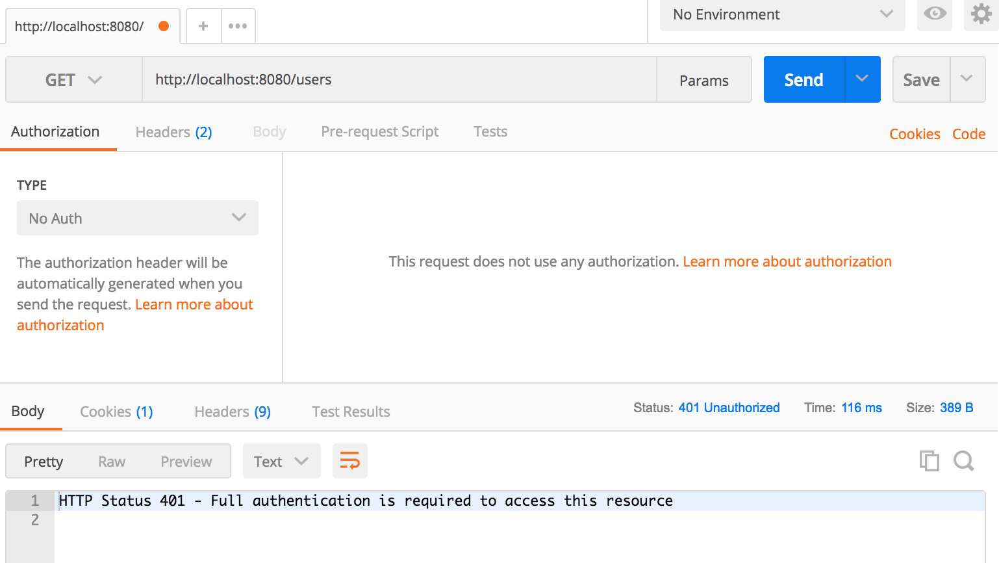
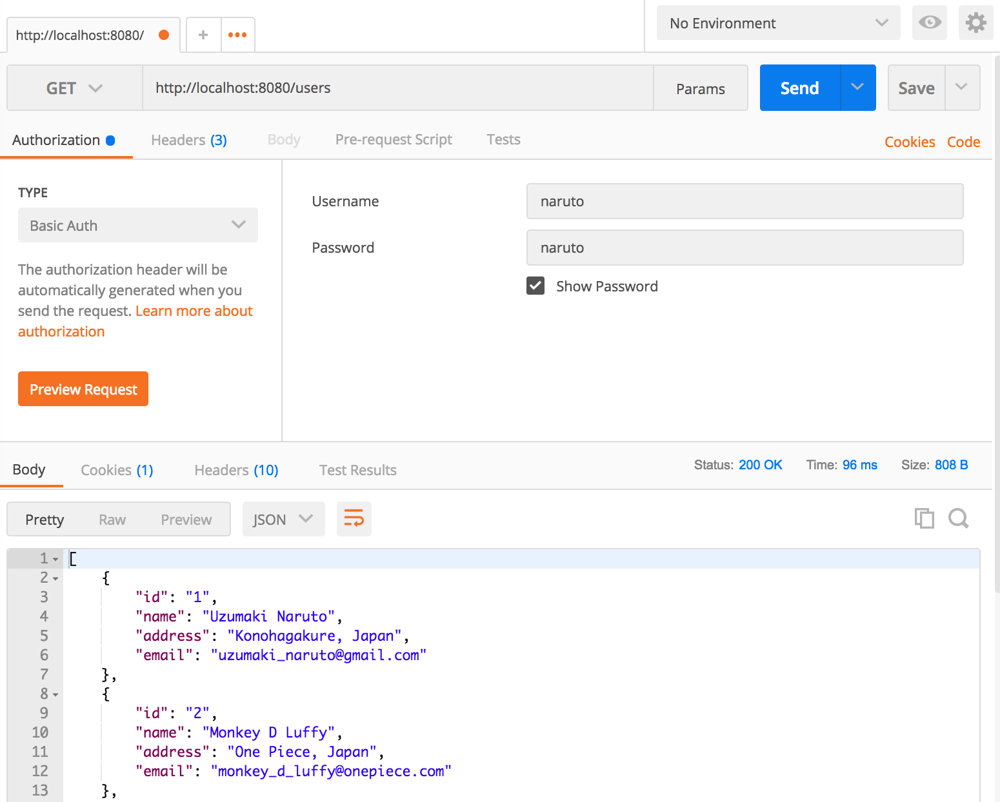
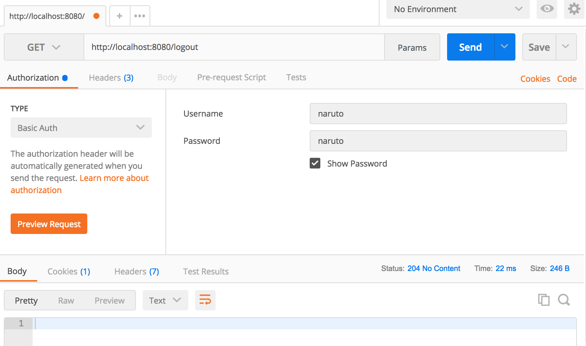

# Spring Security Basic Auth

#### This is an example about using Spring Security Basic Auth

#### Run Application :

1. `mvn clean spring-boot:run`

2. Launch Postman

3. Make a GET request againts http://localhost:8080/users with empty authorization and a 401 - Unauthorized response can be noticed as below :

    

4.  Now enter username/password as naruto/naruto and make GET Request again and you can see the following result.

    

5. Logout http://localhost:8080/logout

    

