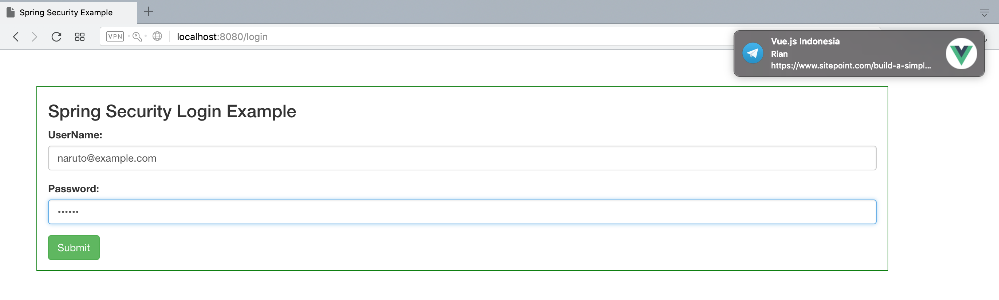
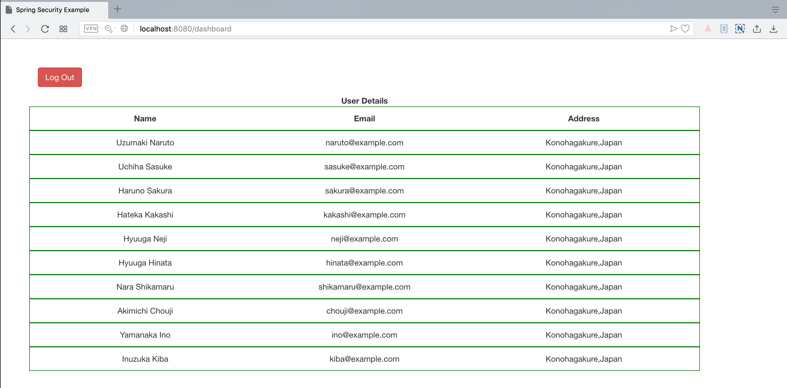

# Spring Security Hibernate Example

#### This is an example for using Spring Security Hibernate loading from MySQL Database

Run this project by this command :

`mvn clean spring-boot:run`

### Screenshot

Login Page

List User Login

